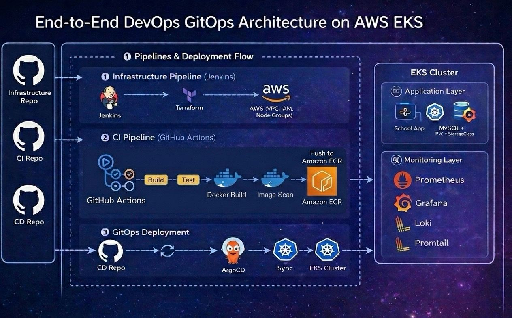

# 🚀 School Management System – End-to-End DevOps Platform

#### 📌 Overview

This project demonstrates a complete DevOps lifecycle implementation for a School Management System application deployed on AWS EKS using modern DevOps practices.

The platform includes:

- Infrastructure as Code (Terraform)
- Pipeline (GitHub Actions + AWS ECR)
- GitOps Continuous Deployment (ArgoCD)
- Kubernetes-native Monitoring Stack
- Production-oriented Kubernetes configuration
  
⸻

#### 🏗 Architecture Diagram



⸻

#### 🏗 Architecture Flow

###### 1️⃣ Infrastructure Pipeline (Jenkins + Terraform)

- Provisions AWS infrastructure using Terraform
- Creates VPC, IAM Roles, EKS Cluster, Node Groups
- Configures remote state (S3)
- Installs ArgoCD on EKS
- Bootstraps the Root Application

Infrastructure lifecycle is isolated from application lifecycle.

###### 2️⃣ CI Pipeline (GitHub Actions)

Triggered on every push to the application repository:

- Builds Docker image
- Authenticates to AWS using OIDC (no static credentials)
- Pushes image to Amazon ECR
- Updates image tag in CD repository

Flow:

Code Push → GitHub Actions → Docker Build → Push to ECR → Update CD Repo

###### 3️⃣ GitOps CD (ArgoCD)

- Watches CD repository
- Detects manifest changes
- Automatically syncs to EKS
- Applies self-healing & drift correction

Deploys:
- School Application
- MySQL (with PVC & StorageClass)
- Monitoring Stack (Helm-based)

⸻

#### 📦 Repositories Structure

###### 🏗 Infrastructure Repository

Terraform + Jenkins

Handles:

- AWS provisioning
- EKS cluster creation
- IAM configuration
- ArgoCD installation
- Root App bootstrap

🔗 Repo Link:
https://github.com/Ahmedlebshten/School_Management_System_Infra

⸻

###### 🔁 CI Repository

GitHub Actions + AWS ECR

Handles:

- Application build
- Docker image creation
- Push to Amazon ECR
- Automated image versioning
- CD repo image tag update

🔗 Repo Link:
https://github.com/Ahmedlebshten/School_Management_System_CI

⸻

###### 🚀 CD Repository

ArgoCD GitOps Deployment

Handles:

- Kubernetes manifests
- ConfigMaps & Secrets
- Resource Requests & Limits
- Liveness & Readiness Probes
- MySQL Persistent Storage (EBS via StorageClass)
- Monitoring stack via Helm
- Auto-sync & self-healing

🔗 Repo Link:
https://github.com/Ahmedlebshten/School_Management_System_CD

⸻

Registry: Amazon ECR
```
731628759499.dkr.ecr.us-east-1.amazonaws.com/school-management-system:<build-number>
```
Images are built and pushed automatically by GitHub Actions using AWS OIDC authentication.

⸻

#### 📊 Monitoring Stack
Deployed using Helm via GitOps model:

- Prometheus (Metrics)
- Grafana (Visualization)
- Loki (Logs)
- Promtail (Log shipping)

All running inside the cluster with Kubernetes-native configuration.

⸻

#### 🛠 Technologies Used

- AWS (EKS, IAM, ECR, S3)
- Terraform
- Jenkins (Infrastructure pipeline)
- GitHub Actions (CI)
- Docker
- Kubernetes
- ArgoCD (GitOps CD)
- Helm
- Prometheus
- Grafana
- Loki

⸻

#### 🎯 What This Project Demonstrates

- End-to-end DevOps lifecycle
- Infrastructure as Code (Terraform)
- CI/CD separation of concerns
- GitHub OIDC integration with AWS
- Private container registry (ECR)
- GitOps-based Kubernetes deployment
- Production-oriented Kubernetes configuration
- Persistent storage using EBS
- Monitoring & Observability implementation
	
⸻

#### 📬 Reach Me

•  GitHub: [https://github.com/Ahmedlebshten]

•  LinkedIn: [https://www.linkedin.com/in/ahmedlebshten]

•  Email: [ahmedlebshtenlebshten@gmail.com]
   
⭐ Star this project if you find it useful! Production Ready - Fully Automated
